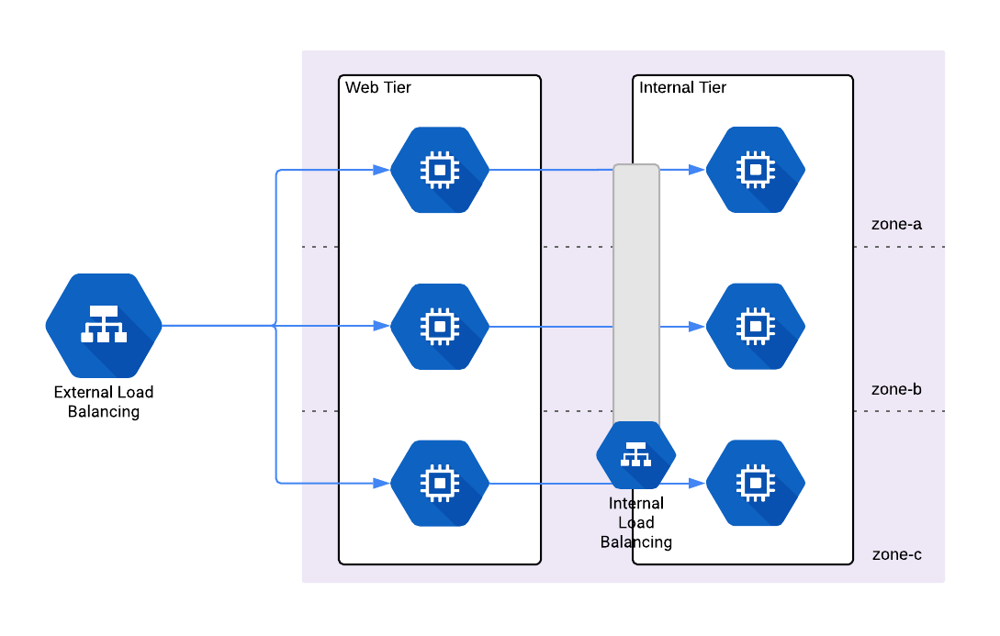

# Cloud Load Balancer Modules

This part of the repo contains modules to perform load balancing on [Google Cloud Platform (GCP)](https://cloud.google.com/) using [Google Cloud Load Balancing](https://cloud.google.com/load-balancing/).

## Cloud Load Balancer Architecture

## Features

- Load balance HTTP and HTTPS traffic across multiple backend instances, across multiple regions with HTTP(S) Load Balancing.
- Load balance internal TCP/UDP traffic with Internal Load Balancing
- Load balance external TCP/UDP traffic with Network Load Balancing

## Learn

This repo is a part of a collection of reusable, battle-tested, production ready infrastructure code.
 
### Core concepts

- [What is Cloud Load Balancing](_docs/core-concepts.md#what-is-cloud-load-balancing)
- [HTTP(S) Load Balancer Terminology](_docs/core-concepts.md#https-load-balancer-terminology)
- [Internal Load Balancer Terminology](_docs/core-concepts.md#internal-load-balancer-terminology)
- [Network Load Balancer Terminology](_docs/core-concepts.md#network-load-balancer-terminology)
- [Cloud Load Balancing Documentation](https://cloud.google.com/load-balancing/)

## Modules

* [http-load-balancer](http/README.md) is used to create an [HTTP(S) External Load Balancer](https://cloud.google.com/load-balancing/docs/https/).
* [internal-load-balancer](internal/README.md) is used to create an [Internal TCP/UDP Load Balancer](https://cloud.google.com/load-balancing/docs/internal/).
* [network-load-balancer](network/README.md) is used to create an [External TCP/UDP Load Balancer](https://cloud.google.com/load-balancing/docs/network/).

## Manage

### Day-to-day operations

- [How to configure a custom domain](_docs/core-concepts.md#how-do-you-configure-a-custom-domain)
- [How to configure SSL](_docs/core-concepts.md#how-do-you-configure-ssl)
- [How to configure access logging and monitoring](_docs/core-concepts.md#how-do-you-configure-access-logging-and-monitoring)
